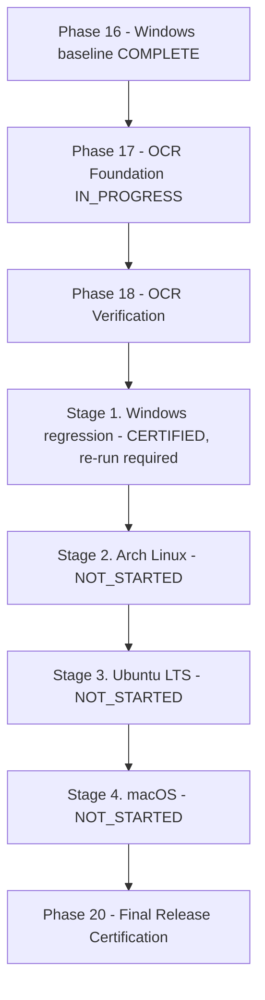

# Cross-Platform Desktop Certification Governance

**Document ID:** `CROSS_PLATFORM_DESKTOP_CERTIFICATION`  
**Status:** Canonical Architecture Specification  
**Authority:** Master Plan Mandatory Post-OCR Pre-Release Platform Gate  
**Scope:** Windows, Linux (Arch + Ubuntu LTS), and macOS Desktop Distributions  

---

## 1. Executive Mandate

Read & Watch is a cross-platform desktop workstation engineered from **one shared codebase** (`App/app/`) with three thin, non-forking distribution layers (`App/packaging/`).

To guarantee identical data safety, offline autonomy, and user experience across all supported environments, project governance establishes a **mandatory cross-platform certification gate before final release**.

**Sequencing correction (2026-09-17, explicit user authority):** this gate is no
longer a pre-Phase-17 gate. OCR implementation and OCR verification happen first;
the platform certification stages then run in order, after which final release
certification may begin. The permanent Windows/Linux/macOS requirement and the
30-point contract are unchanged.

---

## 2. Platform Certification Sequence

### Current Platform Status Matrix

| Stage | Target Platform | Primary Packaging Format | Reference Environment | Certification Status |
| :--- | :--- | :--- | :--- | :--- |
| **1** | **Windows** | NSIS Installer (`.exe`) | Clean Windows 11 Pro Build 26200 VirtualBox VM | **CERTIFIED** |
| **2** | **Arch Linux** | Pacman Package (`.pkg.tar.zst`) | Clean Arch Linux VirtualBox VM | **NOT_STARTED** |
| **3** | **Ubuntu LTS** | Debian Package (`.deb`) | Clean Ubuntu 24.04 LTS VirtualBox VM | **NOT_STARTED** |
| **4** | **macOS** | Apple Disk Image (`.dmg`) | Apple-backed runner / authentic macOS hardware | **NOT_STARTED** |
| **—** | **Phase 17 (OCR)** | N/A | Application implementation phase | **IN_PROGRESS (implemented before certification)** |
| **—** | **Phase 18 (OCR verification)** | N/A | Application verification phase | **NOT_STARTED** |

*(Note: Stage 1 Windows is certified from the Phase 16 baseline; it must be
re-run against the OCR-era build before final release. Certification for Arch
Linux, Ubuntu LTS, and macOS remains genuinely outstanding and is not claimed.)*

---

## 3. Platform Certification Contract (The 30 Invariants)

Regardless of the underlying operating system or package format, every platform distribution must unconditionally pass an identical 30-point behavioral contract in a clean, isolated environment:

1. **Canonical Source Provenance:** Package built exclusively from a verified, tracked Git commit.
2. **Artifact Integrity & Recorded SHA-256:** Package hash recorded in cryptographic evidence ledger prior to installation.
3. **Clean Installation:** Unattended or standard user-space setup completes with zero errors.
4. **Cold Launch Autonomy:** Installed application cold-launches from desktop shortcut/menu.
5. **No Repository Dependency:** Zero filesystem reads from the Git source repository.
6. **No Dev-Server Dependency:** Zero reliance on Vite, Next/Vinext dev servers, or hot-reload daemons.
7. **No External Node Daemon:** Zero external `node.exe`, `npm`, or global Node runtime prerequisites.
8. **Process Tree Conformance:** Only the packaged Electron binary and Chromium child workers execute.
9. **Loopback Service Isolation:** Internal HTTP/WS service binds strictly to `127.0.0.1` ephemeral ports with session token validation; zero public network listeners.
10. **PDF Engine Functionality:** High-DPI rendering, navigation, outline, zoom, rotation, and text search operational.
11. **Reflowable EPUB Functionality:** Foliate adapter loads, renders reflowable layout, navigates TOC, and tracks position.
12. **Annotation Persistence:** Highlights and textual annotations persist across full application shutdown and cold reopen.
13. **Bookmark Persistence:** Page and document bookmarks persist accurately.
14. **Notes and Thoughts Persistence:** Markdown-linked notes persist under local user data.
15. **Canvas Functionality:** Excalidraw whiteboards create, render shapes/text, and persist cleanly.
16. **Knowledge Graph Functionality:** Semantic node-link graphs and Mermaid diagrams render strictly.
17. **Mermaid Diagram Strict Rendering:** Standard flowcharts and sequence diagrams render without syntax failures.
18. **Library Search:** Instant metadata search functional over local SQLite index.
19. **Global / Study Search:** FTS5 full-text indexing and querying operational across all user content.
20. **Settings Persistence:** User preferences (theme, typography, defaults) persist across restarts.
21. **Settings Reset Data Safety (Hard Gate):** Resetting settings to defaults never damages or clears user databases, notes, canvases, or annotations.
22. **Privacy Route:** In-app `/privacy` page renders offline with exact version and zero cloud dependencies.
23. **Terms Route:** In-app `/terms` page renders offline with exact version.
24. **File Associations ("Open With"):** Double-clicking or invoking OS "Open With" on supported files forwards the event cleanly to the app.
25. **Single-Instance Forwarding:** Opening a second document focuses the existing instance without spawning competing database writers.
26. **Offline Core Guarantee:** All primary functionality operates with zero network connectivity.
27. **Tamper-Evident Backup:** `.rwbackup` creation completes with valid SHA-256 payload checksum manifest; source books excluded as designed.
28. **Deterministic Restore:** Restoring backup into an isolated directory restores all canonical user state.
29. **Source Immutability:** Original book fixtures remain 100% bit-identical after reading, annotating, and exporting.
30. **Uninstall Data Retention:** Uninstalling the package removes all application binaries while strictly preserving user libraries, annotations, and databases. Subsequent reinstallation reconnects seamlessly.

---

## 4. Platform Specific Execution Plans

### 4.1 Stage 1: Windows (CERTIFIED)
- **Environment:** Clean Windows 11 Pro Build 26200 VM in Oracle VirtualBox 7.2.18 (`ReadWatch-Windows-CrossPlatform-30`).
- **Artifact:** `Read & Watch Setup 0.1.0.exe` (252,674,455 bytes, SHA-256 `E2A9F16EC02214B50479AF89BDB7ED2DE5FA78C203A3C27D5F4DE181E9793F09`, Git commit `ada8b20205cfe3e51e461b0bc6e249e9b14d7408`).
- **Certification Date:** 2026-09-17 00:36:04 UTC.
- **Result:** **100% PASS (30/30 Invariants Passed, 0 Failures)**.
- **Evidence Ledger:** `READ_WATCH_DATA_ROOT/cross-platform/windows/evidence/` (`WINDOWS_30_POINT_CERTIFICATION_RESULTS.json`, `WINDOWS_30_POINT_CERTIFICATION_REPORT.md`, `INV01` through `INV30`).
- **Formal Certification Report:** [`WINDOWS_CROSS_PLATFORM_CERTIFICATION.md`](file:///App/docs/project/reports/WINDOWS_CROSS_PLATFORM_CERTIFICATION.md).
- **Host Sandbox Note:** Evaluated on Windows 11 Home; documented as an informational host edition limitation only.

### 4.2 Stage 2: Arch Linux (NOT_STARTED)
- **Environment:** Clean Arch Linux VM in Oracle VirtualBox.
- **Artifact:** Native pacman package (`.pkg.tar.zst`) + standalone `.AppImage`.
- **Focus Areas:** Pacman integration, XDG path conventions, Wayland/X11 compatibility, FUSE handling, and single-instance Unix domain socket forwarding.

### 4.3 Stage 3: Ubuntu LTS (NOT_STARTED)
- **Environment:** Clean Ubuntu 24.04 LTS VM in Oracle VirtualBox.
- **Artifact:** Debian package (`.deb`) + standalone `.AppImage`.
- **Focus Areas:** `dpkg`/`apt` installation, standard `/usr/share/applications` launcher, shared library linkage (`ldd`), and GNOME Shell integration.

### 4.4 Stage 4: macOS (NOT_STARTED)
- **Environment:** Authentic Apple-backed infrastructure (GitHub Actions macOS runner and/or genuine Mac hardware).
- **Artifact:** Signed & notarized `.dmg` containing `Read & Watch.app` (`arm64` and `x64`).
- **Focus Areas:** Gatekeeper assessment, Hardened Runtime entitlements, `open-file` Finder event handling, and macOS native menu integration.

---

## 5. Transition to Final Release Certification

Only after successful completion, evidence vault archiving, and governance
sign-off of Stages 1 through 4 — and only after OCR implementation and OCR
verification are complete — may `PHASE-20` (Final Release Certification) begin.

Order of operations (unchanged from the corrected sequence in
`docs/project/MASTER_PLAN.md`):

1. Phase 17 OCR foundation implementation (in progress).
2. Phase 18 OCR verification, uncertainty, and correction work, as evidenced.
3. Stage 1 Windows regression / clean certification on the OCR-era build.
4. Stage 2 Arch Linux clean VM.
5. Stage 3 Ubuntu LTS clean VM.
6. Stage 4 macOS on authentic Apple-backed infrastructure.
7. Phase 20 final release certification.

No stage is claimed as passed until its own evidence exists.
