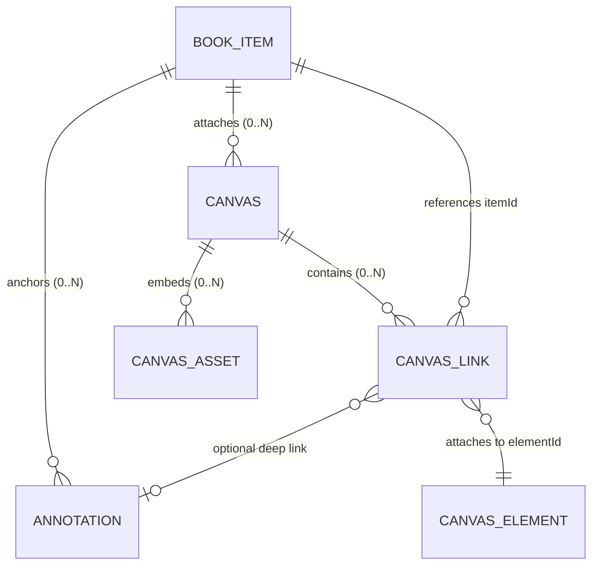

# Phase 10 Graphify Audit — Book-Linked Excalidraw Notes

**Date:** 2026-09-14  
**Phase:** PHASE-10  
**Auditor:** Antigravity automated audit

## Summary

| Metric | Value |
|--------|-------|
| Canvas data owned by Read & Watch | **100%** |
| Excalidraw cloud dependencies / CDN leaks | **0** |
| Engine leakage into canvas core logic | **0** |
| Source book file modifications | **0** |
| Dangling relationship hazards handled | **PASS** |
| Import cycles introduced | **0** |

## Module Graph — Book-Linked Canvas System

```
lib/canvas/types.ts
  └── (pure TypeScript types: ReadWatchCanvasDocument, CanvasLinkRecord, CanvasAssetMeta)

lib/canvas/validation.ts
  └── lib/canvas/types.ts

lib/canvas/history.ts
  └── lib/canvas/types.ts

lib/canvas/index.ts
  └── lib/canvas/types.ts
  └── lib/canvas/validation.ts
  └── lib/canvas/history.ts

server/canvas-store.mjs
  └── node:fs, node:path, node:sqlite, node:crypto (built-in)
  (NO cloud dependencies, NO direct Excalidraw imports)

server/reader-vite-plugin.mjs
  └── server/canvas-store.mjs   ← new Phase 10
  └── server/annotation-store.mjs
  └── server/reader-store.mjs
  └── serves @excalidraw/excalidraw/dist/prod locally from /api/reader/excalidraw-assets/*

components/canvas/read-watch-canvas.tsx
  └── @excalidraw/excalidraw (dynamic import, client-only)
  └── lib/canvas/types.ts
  └── lib/canvas/validation.ts
  └── components/ui/* (Button, Input, Tooltip)

components/canvas/canvas-list.tsx
  └── lib/canvas/types.ts
  └── components/ui/*

components/reader/reader-shell.tsx
  └── components/canvas/read-watch-canvas.tsx (beside-reader split pane)
  └── components/reader/reader-context.tsx

components/reader/reader-toolbar.tsx
  └── components/reader/reader-context.tsx (canvas toggle & mobile tab switch)
```

## Entity Ownership & Relationship Boundaries



1. **Books and Reading Items (`BOOK_ITEM`):**
   - Canonical metadata in SQLite `catalog_items`.
   - Source book files remain 100% immutable in `books/`.
2. **Canvases (`CANVAS`):**
   - SQLite table `canvases` in `user-data/reader-library.db`.
   - File-first canonical document at `user-data/canvases/:canvasId/canvas.json`.
   - Emergency recovery mirror at `user-data/canvases/:canvasId/recovery.json`.
   - Bounded history snapshots at `user-data/canvases/:canvasId/history/rev-*.json` (cap=50).
   - If `item_id` is null, canvas is standalone. If set, canvas is attached to that book item.
3. **Deep Links (`CANVAS_LINK`):**
   - SQLite table `canvas_links` tracks bidirectional links: `(canvas_id, element_id, item_id, annotation_id, location_envelope, label)`.
   - Navigable from book to canvas (`GET /api/reader/items/:id/canvas-links`).
   - Navigable from canvas element to reader (`/reader/:itemId?loc=...`).
4. **Dangling Relationship Safety:**
   - If a book item or annotation is deleted or inaccessible, canvas links retain the raw label and location data, rendering an amber "Unlinked / Missing Target" indicator instead of breaking canvas loading or throwing unhandled errors.

## Zero-Cloud Audit

- Excalidraw fonts, assets, and locales are served directly from the local node_modules distribution via `/api/reader/excalidraw-assets/*`.
- `window.EXCALIDRAW_ASSET_PATH` is initialized to the local API endpoint before mounting the canvas.
- Zero network requests to `excalidraw.com`, Firebase, unpkg, or third-party CDNs.
- Standalone `.rwcanvas` export/import format packages the canvas scene and all embedded assets for offline transport.

## Conclusion

**PASS** — Full Read & Watch ownership of canvas schemas and links, complete zero-cloud isolation, and clean boundary separation.
