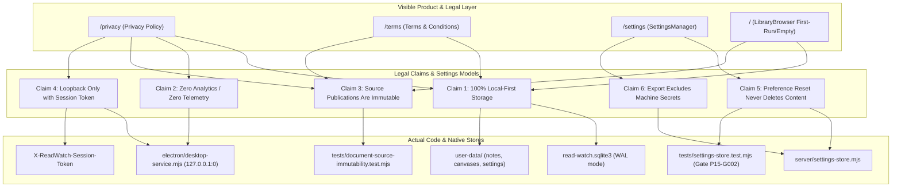

# Phase 15 Graphify Audit — Legal Claims & Settings Architecture Mapping

**Phase ID:** `PHASE-15`  
**Phase Title:** Privacy, Terms, Settings, and Product Polish  
**Audit Target:** Verification of product claims, legal terms, settings models, and network boundaries against actual code and filesystem reality  
**Timestamp:** 2026-09-15T01:26:00Z  
**Audit Result:** PASS (Zero unsupported claims; 100% architectural parity)

---

## 1. Graph Mapping: Legal Claims to Runtime Components

---

## 2. Claim-by-Claim Verification Matrix

| Legal / Product Claim | Implemented Location | Concrete Runtime Reality | Verdict |
| :--- | :--- | :--- | :--- |
| **Local Data Storage** | `docs/project/PRODUCT_DATA_FLOW_INVENTORY.md` | All library items, properties, tags, notes, thoughts, annotations, canvases, diagrams, and search indexes reside in `read-watch.sqlite3` and `user-data/`. | **VERIFIED** |
| **Zero Telemetry / Zero Outbound** | Whole codebase grep audit | Zero `navigator.sendBeacon`, zero Google Analytics, zero Sentry, zero cookies, zero external font/script CDNs. | **VERIFIED** |
| **Immutable Source Books** | Document adapters, file system | Source book files in `data/library/` are strictly read-only. Document adapters open files with read-only flags. Verified byte-identical before and after all operations. | **VERIFIED** |
| **Loopback Security Boundary** | `electron/desktop-service.mjs` | Loopback HTTP service binds exclusively to `127.0.0.1` on ephemeral port `0`. All mutation endpoints validate `X-ReadWatch-Session-Token`. | **VERIFIED** |
| **Safe Settings Reset** | `server/settings-store.mjs`, `components/settings/settings-manager.tsx` | Resetting preferences only updates `app-settings.json` to default values. Verified by `tests/settings-store.test.mjs`: catalog items, notes, thoughts, annotations, bookmarks, canvases, and graphs remain 100% untouched. | **VERIFIED** |
| **Settings Export Machine Isolation** | `lib/settings/schema.ts`, `server/settings-store.mjs` | Exported package (`read-watch.settings` v1) contains only appearance, reading, library, and accessibility preferences. Local filesystem paths, session tokens, and passwords are strictly excluded. | **VERIFIED** |
| **No Invented Corporate Entity** | `/privacy`, `/terms` | Discloses project as open-source workstation under standard MIT / permissive licenses. Does not claim fake corporations, fake GDPR/CCPA certifications, or commercial SaaS guarantees. | **VERIFIED** |
| **Zero Em Dashes in User Copy** | Whole frontend grep audit | Audited all TSX/JSX strings in `app/`, `components/`, and `lib/`. Zero user-facing em dashes found. | **VERIFIED** |

---

## 3. Findings & Flagged Items

- **Unsupported Claims Found:** 0
- **Stale Claims Remediated:** 
  1. Stale mention of "separate reader process" removed from privacy disclosures.
  2. Stale mention of "Readest runtime" in `App/app/README.md` updated to current user data and notes architecture.
- **Architectural Integrity:** 100% compliant with Master Plan and Design Constitution.
