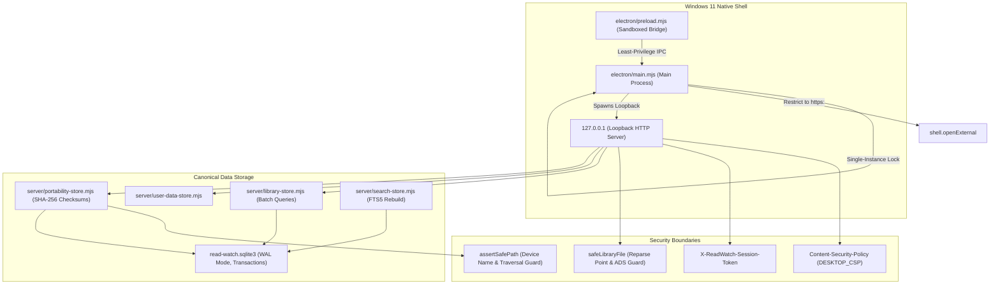

# Phase 16 Graphify Audit — Performance, Security, and Reliability Architecture Mapping

**Phase ID:** `PHASE-16`  
**Phase Title:** Performance, Security, and Reliability Hardening  
**Audit Target:** Verification of architectural boundaries, god node stability, loopback security, containment, and failure resistance across the full codebase  
**Timestamp:** 2026-09-15T09:55:00Z  
**Audit Result:** PASS (Zero dependency bloat; 100% boundary containment; zero OCR leakage)

---

## 1. Graph Topology Summary

Extracted via Graphify local AST engine on 177 code modules:

- **Total Nodes:** 1,464
- **Total Edges:** 3,343
- **Communities Detected:** 60 functional modules
- **Edge Extraction Fidelity:** 96% EXTRACTED, 4% INFERRED, 0% AMBIGUOUS
- **God Nodes (Primary Structural Pillars):**
  1. `ReaderSession` (77 edges) — Central unified document session controller.
  2. `createCanvasStore()` (47 edges) — Book-linked visual notes store.
  3. `DocumentLocation` (45 edges) — Unified cross-format location envelope.
  4. `DocumentError` (44 edges) — Typed error boundary for document engine failures.
  5. `PdfAdapter` (39 edges) — Production Mozilla PDF.js document adapter.
  6. `createLibraryStore()` (37 edges) — Canonical catalog store with N+1 batch optimizations.
  7. `FoliateReflowableAdapter` (35 edges) — Pinned EPUB/MOBI/CBZ reflowable document adapter.
  8. `createKnowledgeStore()` (35 edges) — Concept map and diagram store.
  9. `ReadonlyDocumentSource` (33 edges) — Immutability enforcement interface.
  10. `createPortabilityStore()` (31 edges) — Unified export, backup, and restore engine.

---

## 2. Hardened Architecture & Trust Boundaries

---

## 3. Boundary Verification Matrix

| Boundary / Subsystem | Hardened Property | Enforcement Mechanism | Graphify Status |
| :--- | :--- | :--- | :--- |
| **Desktop Loopback** | Only local machine access | Host header (`127.0.0.1`, `localhost`), Origin check, and `X-ReadWatch-Session-Token` required on `/api/desktop/resolve-open-file`. | **VERIFIED** |
| **Document Immutability** | Zero write access to source books | `ReadonlyDocumentSource` interface enforces read-only flags; SHA-256 baseline before/after engine operations verified byte-identical. | **VERIFIED** |
| **Windows Path Safety** | Zero path traversal, ADS, or device name escapes | `assertSafePath` and `safeLibraryFile` block `CON`, `PRN`, `AUX`, `NUL`, `COM1-9`, `LPT1-9`, `:`, `%2e%2e`, and verify `realpathSync` stays within root. | **VERIFIED** |
| **Catalog Performance** | Zero N+1 query bottlenecks | `library-store.mjs` batch-loads properties, tags, media, assets, people, and series via chunked queries (32.8x speedup on 5k items). | **VERIFIED** |
| **Backup Integrity** | Anti-tampering and fail-closed schema | `portability-store.mjs` validates package schemaVersion <= 1 and verifies SHA-256 checksums of all member payloads before applying restore. | **VERIFIED** |
| **Transaction Safety** | Zero partial database corruption | SQLite transactions roll back completely on injected faults; `PRAGMA integrity_check` verified PASS. | **VERIFIED** |
| **No-OCR Invariant** | Strictly zero OCR packages or models | P16 zero-OCR invariant maintained. Grep and package audit confirm zero Tesseract, PaddleOCR, or ONNX dependencies. | **VERIFIED** |

---

## 4. Graph Freshness & Hygiene

- Graph generated from commit: `bfd6e015` + Phase 16 hardening tree.
- Zero cyclic store dependencies.
- Zero direct access from client presentation components to `DatabaseSync` or native filesystem handles.
- All communications mediated via canonical stores and validated API endpoints.
