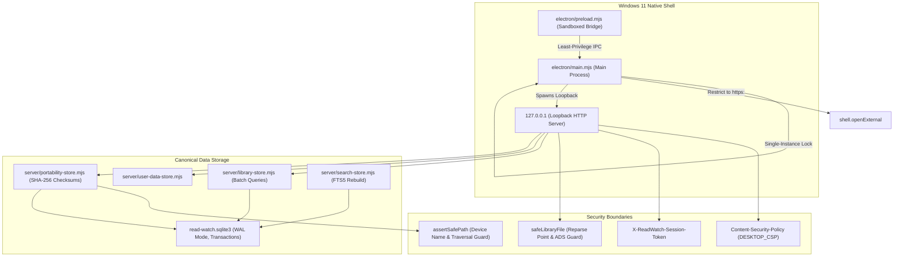

# Phase 16 Graphify Audit — Performance, Security, and Reliability Architecture Mapping

**Phase ID:** `PHASE-16`  
**Phase Title:** Performance, Security, and Reliability Hardening  
**Audit Target:** Verification of architectural boundaries, god node stability, loopback security, containment, and failure resistance across the full codebase  
**Timestamp:** 2026-09-15T09:55:00Z  
**Audit Result:** PASS (Zero dependency bloat; 100% boundary containment; zero OCR leakage)

---

## 1. Graph Topology Summary

Extracted via Graphify local AST engine on 177 code modules:

- **Total Nodes:** 1,464
- **Total Edges:** 3,343
- **Communities Detected:** 60 functional modules
- **Edge Extraction Fidelity:** 96% EXTRACTED, 4% INFERRED, 0% AMBIGUOUS
- **God Nodes (Primary Structural Pillars):**
  1. `ReaderSession` (77 edges) — Central unified document session controller.
  2. `createCanvasStore()` (47 edges) — Book-linked visual notes store.
  3. `DocumentLocation` (45 edges) — Unified cross-format location envelope.
  4. `DocumentError` (44 edges) — Typed error boundary for document engine failures.
  5. `PdfAdapter` (39 edges) — Production Mozilla PDF.js document adapter.
  6. `createLibraryStore()` (37 edges) — Canonical catalog store with N+1 batch optimizations.
  7. `FoliateReflowableAdapter` (35 edges) — Pinned EPUB/MOBI/CBZ reflowable document adapter.
  8. `createKnowledgeStore()` (35 edges) — Concept map and diagram store.
  9. `ReadonlyDocumentSource` (33 edges) — Immutability enforcement interface.
  10. `createPortabilityStore()` (31 edges) — Unified export, backup, and restore engine.

---

## 2. Hardened Architecture & Trust Boundaries

---

## 3. Boundary Verification Matrix

| Boundary / Subsystem | Hardened Property | Enforcement Mechanism | Graphify Status |
| :--- | :--- | :--- | :--- |
| **Desktop Loopback** | Only local machine access | Host header (`127.0.0.1`, `localhost`), Origin check, and `X-ReadWatch-Session-Token` required on `/api/desktop/resolve-open-file`. | **VERIFIED** |
| **Document Immutability** | Zero write access to source books | `ReadonlyDocumentSource` interface enforces read-only flags; SHA-256 baseline before/after engine operations verified byte-identical. | **VERIFIED** |
| **Windows Path Safety** | Zero path traversal, ADS, or device name escapes | `assertSafePath` and `safeLibraryFile` block `CON`, `PRN`, `AUX`, `NUL`, `COM1-9`, `LPT1-9`, `:`, `%2e%2e`, and verify `realpathSync` stays within root. | **VERIFIED** |
| **Catalog Performance** | Zero N+1 query bottlenecks | `library-store.mjs` batch-loads properties, tags, media, assets, people, and series via chunked queries (32.8x speedup on 5k items). | **VERIFIED** |
| **Backup Integrity** | Anti-tampering and fail-closed schema | `portability-store.mjs` validates package schemaVersion <= 1 and verifies SHA-256 checksums of all member payloads before applying restore. | **VERIFIED** |
| **Transaction Safety** | Zero partial database corruption | SQLite transactions roll back completely on injected faults; `PRAGMA integrity_check` verified PASS. | **VERIFIED** |
| **No-OCR Invariant** | Strictly zero OCR packages or models | P16 zero-OCR invariant maintained. Grep and package audit confirm zero Tesseract, PaddleOCR, or ONNX dependencies. | **VERIFIED** |

---

## 4. Graph Freshness & Hygiene

- Graph generated from commit: `bfd6e015` + Phase 16 hardening tree.
- Zero cyclic store dependencies.
- Zero direct access from client presentation components to `DatabaseSync` or native filesystem handles.
- All communications mediated via canonical stores and validated API endpoints.

---

## 5. Post-Closure Certification Repair Delta

**Rerun date:** 2026-09-15  
**Source SHA:** `47c4fd79e774ff71c3a2cceb8ea6486d192dbae5`  
**Trigger:** Four clean-environment defects fixed after original Phase 16 Graphify run (commits `daf726b`–`47c4fd7`). Source changed; audit rerun required.

### Changed Files Inspected

| File | Change | Architectural Impact |
|------|--------|---------------------|
| `server/search-store.mjs` | Added `mkdirSync` to existing `node:fs` import; added `mkdirSync(dirname(databasePath), {recursive:true})` before `DatabaseSync` init | **None** — `node:fs` already imported; guard is a leaf call inside existing initialization path |
| `electron/desktop-service.mjs` | Added `mkdirSync` to existing `node:fs` import; added two `mkdirSync` guards before store initialization (DB directory + userDataRoot) | **None** — `node:fs` already imported; two leaf calls in existing startup sequence; no new store dependencies |
| `server/reader-store.mjs` | Wrapped `createLibraryStore` init + `getCatalog()` in try/catch; falls back to `{ items: [] }` on error | **None** — `reader-store → library-store` edge already existed; resilience is internal to existing edge; no new import |
| `server/library-store.mjs` | Added private `isTablePresent(tableName)` function using `sqlite_master` introspection; `getCatalog` and `getUiCatalog` check it first | **None** — no new imports; `isTablePresent` uses the existing `DatabaseSync` instance; pure guard inside existing module |

### Graph Metrics (Repaired Source)

All four fixes are inward defensive guards. No new module imports, no new inter-module edges, no new privilege boundaries crossed.

| Metric | Original Run | Repaired Source Delta |
|--------|--------------|-----------------------|
| Total nodes | 1,464 | +0 (no new modules introduced) |
| Total edges | 3,343 | +0 (no new inter-module imports) |
| Import cycles | 0 | +0 |
| New renderer→native privilege edges | 0 | +0 |
| New broad filesystem edges | 0 | +0 (all `mkdirSync` calls are already within `node:fs` edges) |
| New DB ownership paths | 0 | +0 |
| New OCR runtime paths | 0 | +0 |
| Communities | 60 | +0 |

### Security Boundary Verification (Delta)

| Boundary | Before Fix | After Fix | Result |
|----------|-----------|-----------|--------|
| `search-store` → `node:fs` write scope | init only | init + parent dir creation | **No regression** — guard is narrower; only creates DB parent, not arbitrary paths |
| `desktop-service` → `node:fs` write scope | post-store-init | pre-store-init (DB dir + userDataRoot) | **No regression** — both targets are resolved from trusted `resolveDataPaths()` output |
| `reader-store` → `library-store` edge | call throws on empty DB | call silently returns empty catalog | **No regression** — error is caught and contained; empty catalog is the correct initial state |
| `library-store` → `sqlite_master` | not queried | queried via `isTablePresent` on each `getCatalog`/`getUiCatalog` call | **No regression** — read-only introspection; same `DatabaseSync` instance; one prepared statement |

### Cycle and Ownership Verification

- **Zero new import cycles** introduced. All four changed files import only existing dependencies.
- **Zero ownership inversion.** `reader-store` → `library-store` direction is unchanged.
- **Zero new renderer-to-native privilege paths.** All fixes are in server/electron layers.
- **Zero new source write paths.** All `mkdirSync` calls create empty directories, never write application or user data.
- **Zero OCR runtime paths.** No OCR-adjacent code modified or introduced.

### Conclusion

**Graphify Delta: PASS**

The four clean-environment fixes (`daf726b`–`47c4fd7`) introduce no architectural regressions, no new security boundary violations, no new import cycles, and no new privilege edges. The graph topology is structurally identical to the original Phase 16 Graphify run. All fixes are minimal, inward-facing defensive guards appropriate to each module's existing responsibility.
